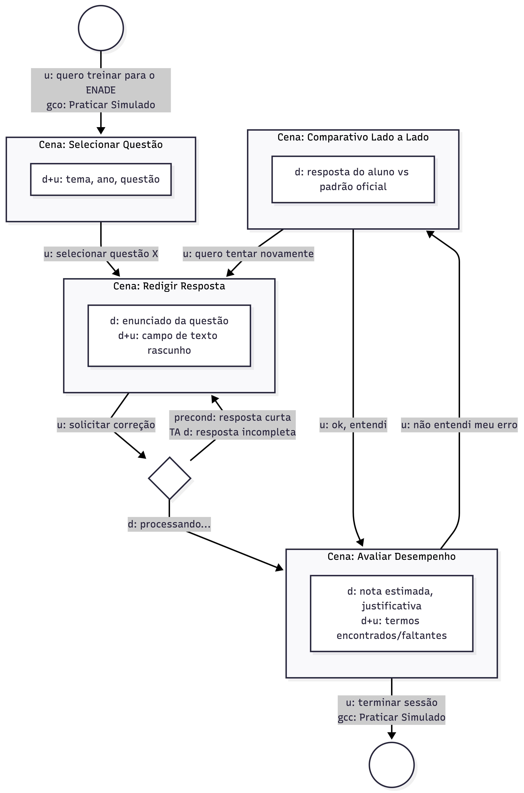
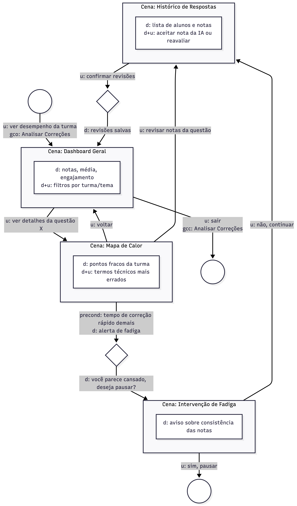

# MOLIC (Modeling Language for Interaction as Conversation)

O MoLIC trata a interface como uma conversa entre o usuário e o designer (através do sistema). Abaixo, os diagramas que representam os dois fluxos principais do QuestIA.

## 1. Metáforas de Interação
- **Para o Aluno:** "Tutor Particular Especializado" - A interface foca em orientar o aluno sobre seus erros e acertos de forma pedagógica.
- **Para o Professor:** "Assistente de Auditoria" - A interface foca em destacar discrepâncias e facilitar a tomada de decisão rápida.

## 2. Diagramas MoLIC

### Cenário: Fluxo de Estudo do Aluno (Simulado)
Abaixo, o diagrama que mostra a jornada do aluno desde a seleção da questão até o feedback detalhado.

### Cenário: Fluxo de Gestão do Professor (Dashboard)
Abaixo, o diagrama que mostra o professor analisando o desempenho da turma e auditando notas sugeridas.

## 3. Detalhamento das Cenas e Rupturas

### Cenas Principais
1. **Seleção de Contexto:** Usuário escolhe entre Simulados (Aluno) ou Dashboard (Professor).
2. **Processamento (Caixa Preta):** O sistema indica que a IA está analisando os dados.
3. **Entrega da Mensagem:** Exibição da nota (Aluno) ou Alerta de Discrepância (Professor).

### Tratamento de Rupturas (Breakdowns)
- **Ruptura de Texto Insuficiente:** Se o aluno envia uma resposta muito curta, o sistema interrompe o fluxo e solicita maior detalhamento antes da correção.
- **Ruptura de Falha de NLP:** Caso o algoritmo não consiga processar o texto, o sistema sugere que o usuário revise a escrita ou reporte o erro para revisão humana manual.
