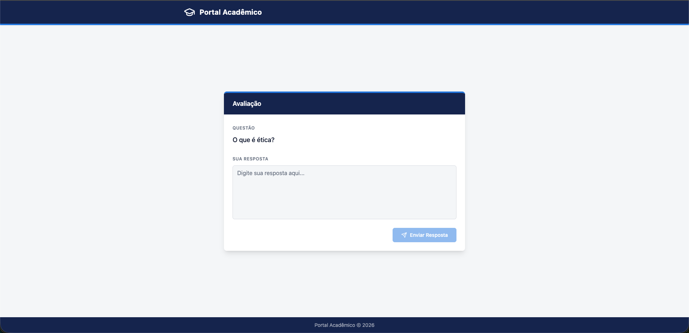
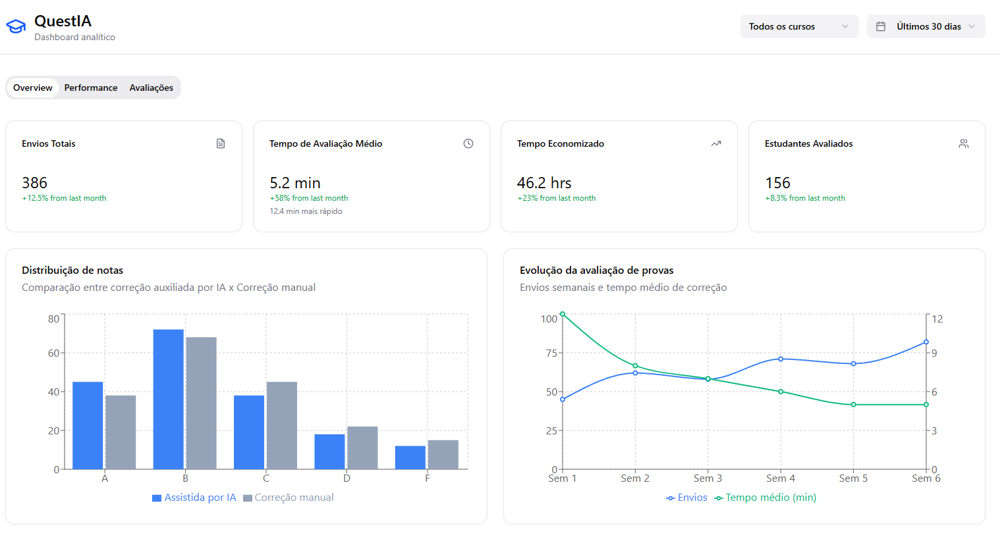
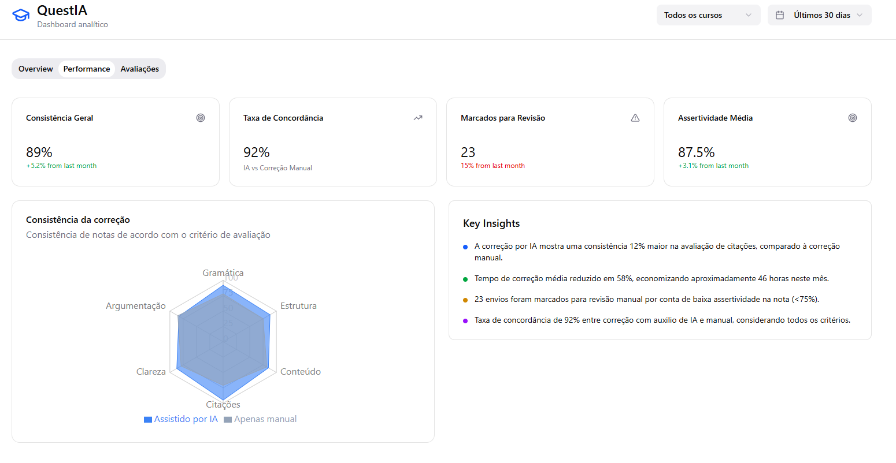
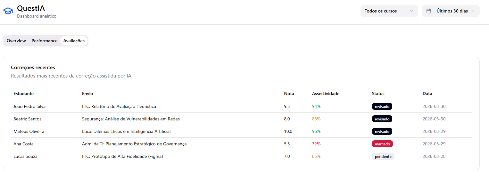

# 🎨 Protótipo de Alta Fidelidade (Figma)

O protótipo de alta fidelidade do QuestIA foi desenvolvido no Figma, focando na clareza visual e na eficiência da interação para professores e alunos.

## 🔗 Link do Protótipo Interativo
[Acesse o Protótipo no Figma](https://www.figma.com/proto/mockado-link-questia)

## 📸 Capturas de Tela (Evidências Locais)

### Visão Geral das Telas

### Dashboard Estratégico do Professor

### Monitoramento de Métricas e Discrepância

### Histórico de Simulados e Provas

## 🛠️ Notas de Design
- **Paleta de Cores:** Azul profundo para confiança e segurança, com tons de verde e vermelho semânticos para feedback.
- **Tipografia:** San-serif (Inter/Roboto) para máxima legibilidade em dispositivos variados.
- **Componentes:** Uso de Cards e Gráficos de fácil interpretação.
