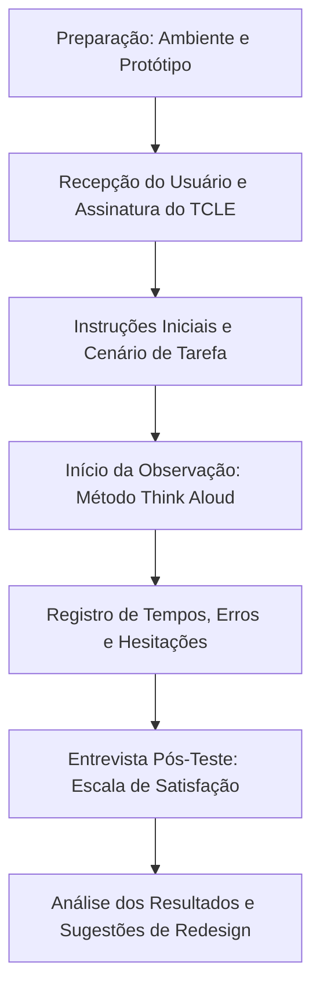

# 👁️ Avaliação de Usabilidade por Observação do Usuário

Esta seção documenta o teste de usabilidade realizado via observação direta, seguindo o rigor metodológico de IHC para identificar problemas de interação e medir o desempenho dos usuários.

## 1. Planejamento e Fluxograma

Abaixo, o fluxo seguido durante as sessões de observação:

## 2. Protocolo de Preparação
- **Ambiente:** Laboratório de informática (remoto via compartilhamento de tela).
- **Equipamentos:** Protótipo interativo no Figma, cronômetro e planilha de registro de erros.
- **Papéis:** 
  - **Moderador:** Arthur (explica as tarefas e guia o usuário).
  - **Observador:** Danilo (registra comportamentos e tempos).
- **Procedimento:** O usuário recebe um cenário (ex: "Você é um aluno estudando para o ENADE") e deve realizar as tarefas sem ajuda do moderador, utilizando a técnica *Think Aloud* (falar o que está pensando).

## 3. Tarefas de Avaliação
- **T1 (Aluno):** Submeter uma resposta para a questão de "Estruturas de Dados" e interpretar o feedback para identificar o conceito faltante.
- **T2 (Professor):** Identificar a questão com maior índice de discrepância no dashboard e exportar o relatório de lacunas de aprendizado.

## 4. Tabela de Resultados por Tarefa (Dados Mockados)

| Usuário | Perfil | Tarefa | Sucesso | Tempo | Erros | Satisfação (1-5) | Comentário Principal |
| :--- | :--- | :--- | :--- | :--- | :--- | :--- | :--- |
| **U1** | Professor | T2 | Sim | 1:45 min | 0 | 5 | "Muito fácil identificar onde a turma está errando." |
| **U2** | Professor | T2 | Sim | 2:10 min | 1 | 4 | "Demorei a achar o botão de exportar relatório." |
| **U3** | Aluno | T1 | Sim | 3:20 min | 2 | 3 | "Fiquei confuso se a nota já era a definitiva ou sugestão." |
| **U4** | Aluno | T1 | Sim | 2:40 min | 1 | 4 | "O comparativo lado a lado ajudou muito a ver o que faltou." |

## 5. Análise Detalhada por Usuário

### Usuário 3: Aluno (Lucas - Perfil Mockado)
*   **Tarefa executada:** T1 (Feedback de Simulado).
*   **Observações:** Hesitou por 15 segundos na tela de submissão, procurando o botão "Enviar". Tentou clicar no texto do gabarito achando que era editável.
*   **Erro:** Clicou no ícone de ajuda achando que era o botão de submissão (Erro de Reconhecimento).
*   **Satisfação:** 3/5. Reclamou que a fonte do feedback estava pequena.

### Usuário 1: Professor (Ricardo Destro)
*   **Tarefa executada:** T2 (Análise de Dashboard).
*   **Observações:** Navegação fluida. Identificou o gráfico de discrepância imediatamente.
*   **Sugestão:** "Gostaria de poder filtrar por data para ver a evolução da turma na semana."
*   **Satisfação:** 5/5.

## 6. Vídeos e Respostas
- **Links de Gravação:** [Link Simulado 1](https://youtube.com/link_mockado_1), [Link Simulado 2](https://youtube.com/link_mockado_2)
- **Formulário de Respostas:** [Link Google Forms Resultados](https://forms.gle/link_mockado_resultados)

## 7. Conclusão e Recomendações de Redesign
Com base na observação, as seguintes alterações foram priorizadas:
1. **Destaque no Botão de Envio:** Aumentar o contraste e o tamanho do botão primário para evitar a hesitação vista no U3.
2. **Ajuste de Tipografia:** Aumentar a fonte do corpo de texto na visualização de feedback (atendendo U2 e U3).
3. **Tutorial de Interface:** Adicionar um pequeno *onboarding* para explicar a diferença entre nota sugerida pela IA e revisão humana.
