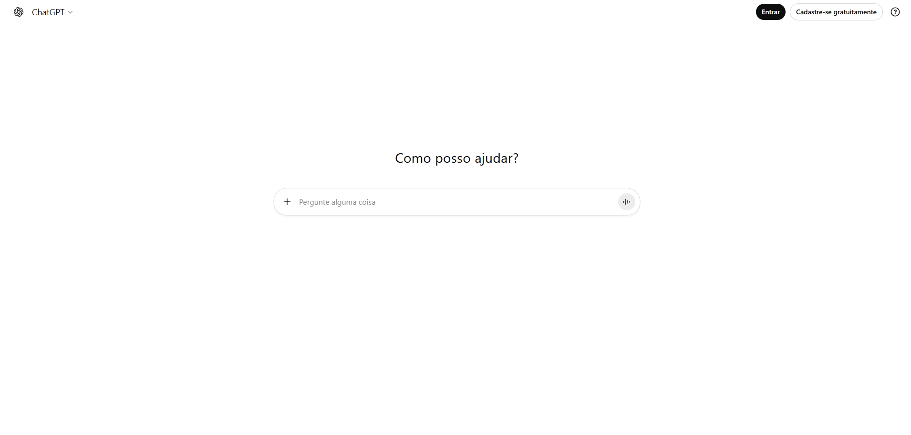
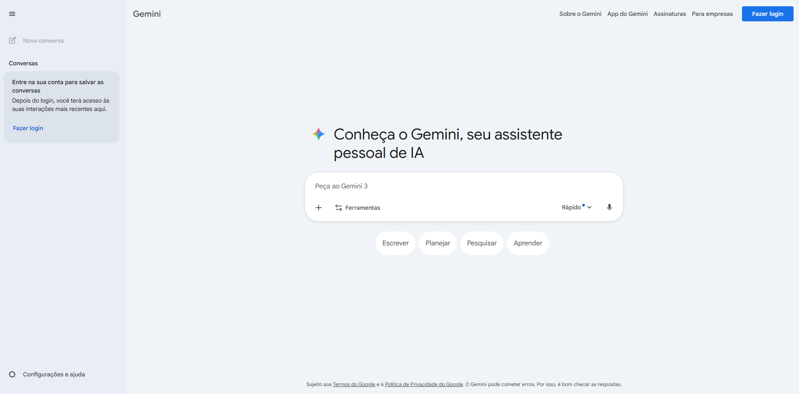
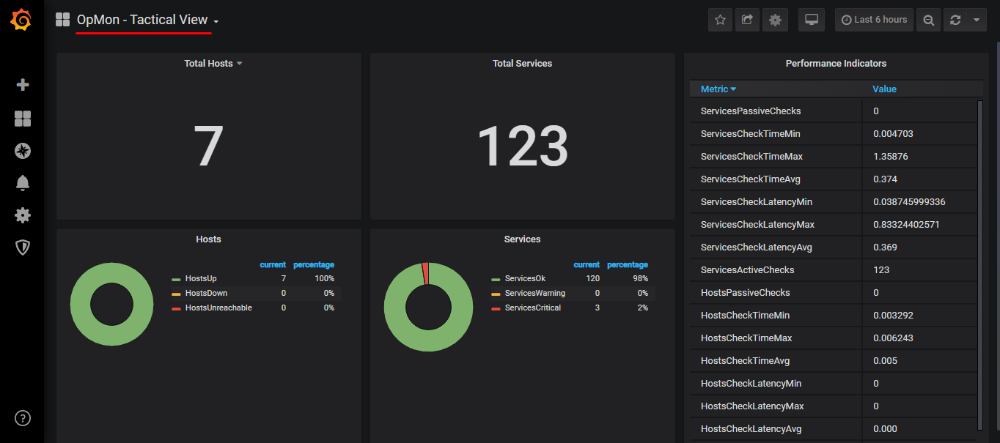
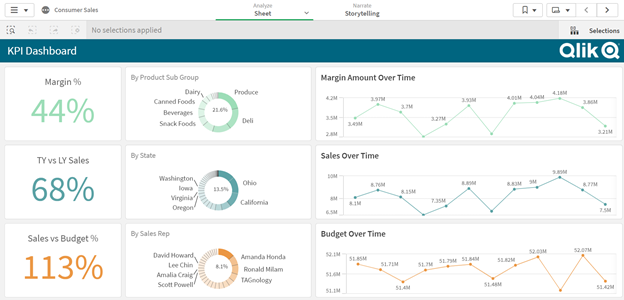

# 📊 Análise de Concorrência

A análise de concorrência do QuestIA foca em três grandes grupos de soluções que atualmente ocupam o espaço de apoio à correção e estudo, visando identificar padrões de interface e lacunas de experiência do usuário.

## 1. Público-Alvo da Análise
- **Professores Universitários:** Buscam agilidade e ferramentas de gestão de turma.
- **Alunos de Graduação (Concluintes):** Buscam feedback imediato e assertivo para simulados.
- **Coordenadores de Curso:** Interessados em métricas de desempenho institucional.

## 2. Análise Sistemática de Concorrentes

### Grupo 1: Ferramentas de GenAI (ChatGPT / Gemini)
- **Descrição:** Modelos de linguagem de propósito geral.
- **Opinião/Análise de UX:** Usuários elogiam a velocidade, mas reclamam da "alucinação" e da falta de critérios técnicos de bancas como o INEP. A interface de chat puro é cansativa para fluxos de correção em lote.
- **Exemplos de Interface:**

### Grupo 2: Plataformas de Dashboard (Grafana / Qlik)
- **Descrição:** Ferramentas de visualização de dados e BI.
- **Opinião/Análise de UX:** Professores consideram a interface "poluída" e técnica demais. É difícil extrair um *insight* pedagógico sem treinamento prévio na ferramenta.
- **Exemplos de Interface:**

### Grupo 3: Ambientes Virtuais (Moodle / Google Classroom)
- **Descrição:** Sistemas de Gestão de Aprendizagem (LMS).
- **Opinião/Análise de UX:** Experiência de correção de questões dissertativas é vista como "arcaica", baseada apenas em caixas de texto e notas manuais, sem auxílio cognitivo.

---

## 3. Tabela de Padrões e Tendências de Mercado

Abaixo, os principais padrões observados na concorrência que influenciam o design do QuestIA.

| Padrão de Interface | Onde foi observado? | Tendência de Uso | Aplicação no QuestIA |
| :--- | :--- | :--- | :--- |
| **Cards de Métricas** | Grafana / Qlik | Exibição de KPIs de forma rápida e isolada. | Uso de cards para "Índice de Discrepância" e "Média da Turma". |
| **Comparação Lado a Lado** | Google Classroom | Facilita a validação de documentos contra uma referência. | Exibição da Resposta do Aluno vs. Padrão de Resposta do INEP. |
| **Feedback por Cores** | Duolingo / Khan Academy | Uso de semântica de cores (verde/vermelho) para acertos. | Mapa de calor de desempenho das questões. |
| **Chat de Apoio** | ChatGPT / Gemini | Interação em linguagem natural para dúvidas. | Assistente de ajuda para explicar os critérios da nota. |
| **Hierarquia Visual de Dashboard** | Grafana | Destaque para dados críticos no topo da página. | Métricas de urgência (baixa nota da turma) aparecem primeiro. |

## 4. Referências e Fontes
1. [OpenAI - ChatGPT](https://chat.openai.com)
2. [Grafana Labs - Dashboards](https://grafana.com)
3. [Moodle - LMS Platform](https://moodle.org)
4. [Google for Education](https://edu.google.com)
