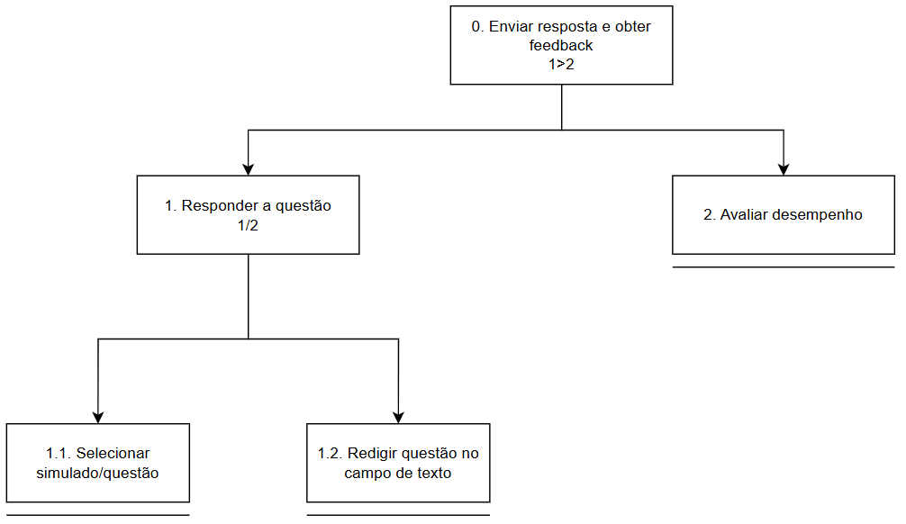
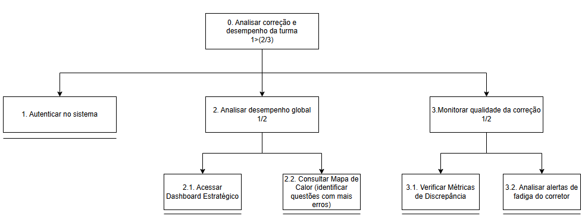
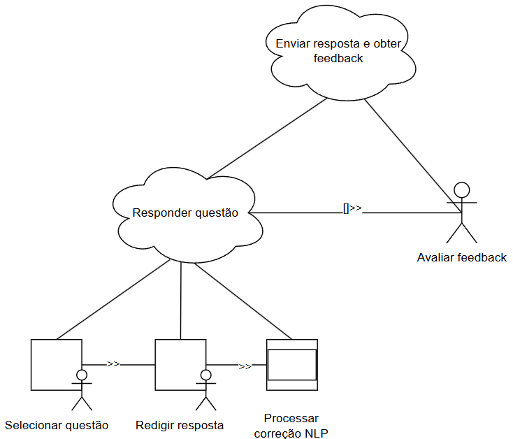
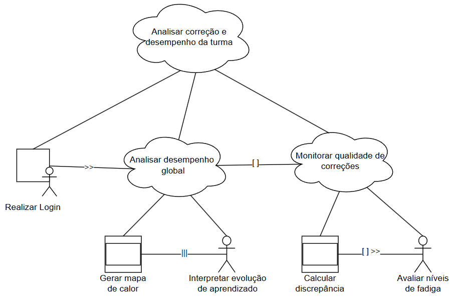

# 📊 Análise de Tarefas

A análise de tarefas permite decompor o trabalho dos usuários em objetivos e ações concretas para orientar o design da interface.

## 1. HTA (Hierarchical Task Analysis)

### Tarefa: Submissão de Resposta e Feedback (Aluno)

### Tarefa: Auditoria de Correção e Gestão (Professor)

---

## 2. GOMS (Goals, Operators, Methods, and Selection Rules)

### Goal: Obter feedback de uma questão dissertativa
- **Method 1:** Escrever resposta diretamente
    - Op 1: Selecionar campo de texto
    - Op 2: Digitar resposta
    - Op 3: Clicar em "Avaliar"
- **Method 2:** Revisar rascunho antes de submeter
    - Op 1: Digitar rascunho
    - Op 2: Clicar em "Revisar"
    - Op 3: Ajustar texto
    - Op 4: Clicar em "Avaliar"
- **Selection Rule:** Usar Method 2 se o usuário estiver inseguro sobre os termos técnicos.

### Goal: Analisar discrepância da turma no dashboard
- **Method 1:** Visualização via Mapa de Calor
    - Op 1: Abrir Dashboard
    - Op 2: Identificar áreas vermelhas
    - Op 3: Clicar no indicador para detalhes
- **Operators:** Clicar, Analisar, Comparar, Decidir.

---

## 3. CTT (ConcurTaskTrees)

Os diagramas abaixo mostram a decomposição das tarefas com foco nas relações temporais (concorrência, sequência e escolha).

### Fluxo do Aluno

### Fluxo do Professor

**Legenda de Relações:**
- **>> (Sequência):** Uma tarefa deve terminar antes da outra começar.
- **[] (Escolha):** O usuário deve escolher entre uma tarefa ou outra.
- **||| (Concorrência):** Tarefas podem ser realizadas ao mesmo tempo.
