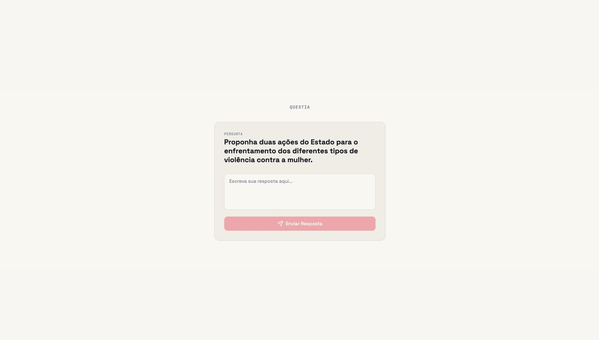
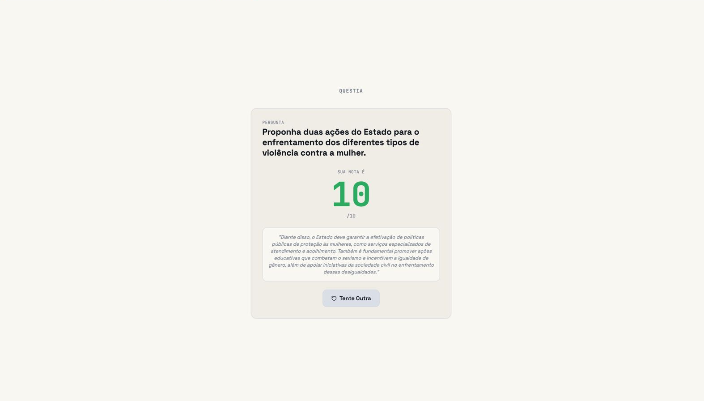
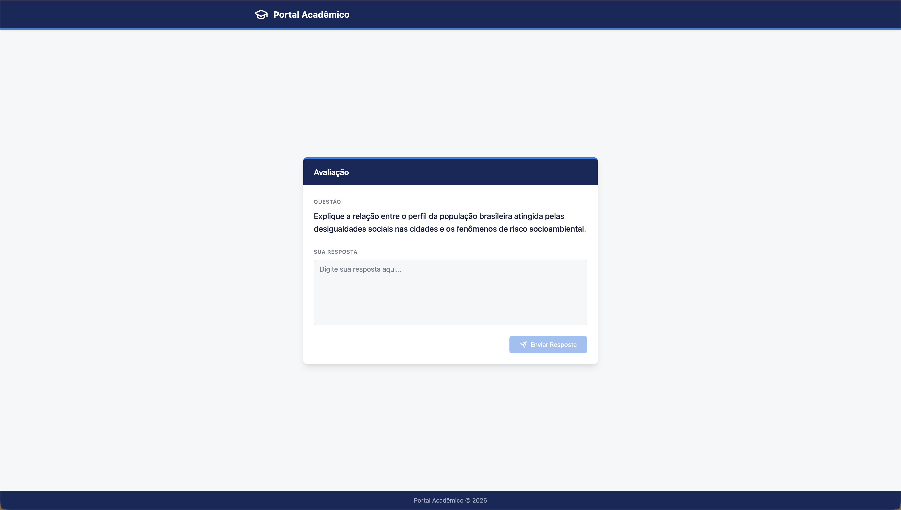
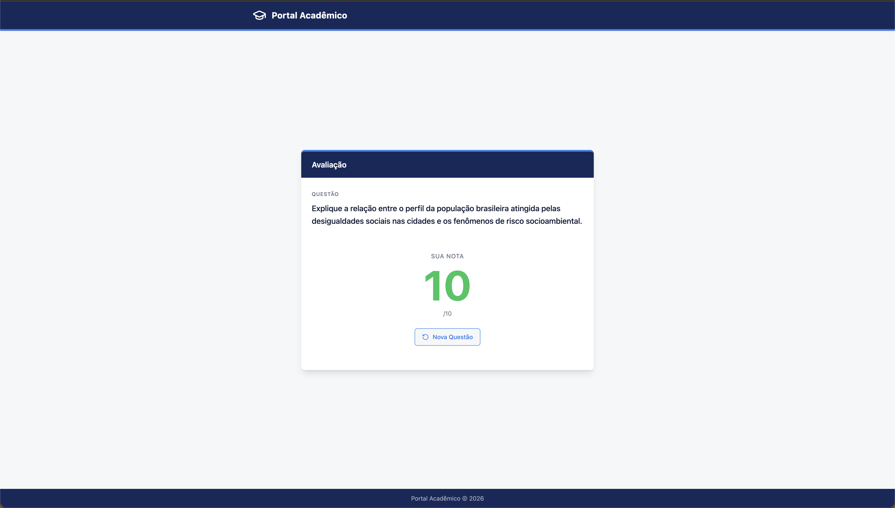

# ✍️ Prototipação e Iteração

O QuestIA passou por ciclos de prototipação para validar a eficácia do feedback de IA e a clareza dos dashboards.

## 1. Protótipo de Média Fidelidade

Abaixo, os rascunhos iniciais que definiram a estrutura de "Comparativo Lado a Lado".

### Tela de Input e Feedback (Modo Aluno)

## 2. Teste e Refinamento com Usuários

Realizamos testes com professores e alunos para identificar ajustes necessários em tipografia e cores.

### Registro de Teste 1 (Fadiga Visual)

**Feedback:** O usuário relatou que o contraste inicial era muito alto para sessões longas.
**Ação:** Reduzimos a vibração do fundo e suavizamos as cores do dashboard.

### Registro de Teste 2 (Legibilidade)

**Feedback:** "A fonte do feedback da IA está difícil de ler no tablet."
**Ação:** Aumentamos a tipografia base para 18px e melhoramos o espaçamento entre linhas.

## 3. Fluxo de Interação Final (Protótipo Figma)

Abaixo, as telas finais resultantes dos ciclos de refinamento.

| Tela | Objetivo | Imagem |
| :--- | :--- | :--- |
| **Dashboard** | Visão macro de desempenho e discrepância. |  |
| **Métricas** | Auditoria detalhada de correção da IA. |  |
| **Histórico** | Acesso rápido a provas anteriores. |  |
