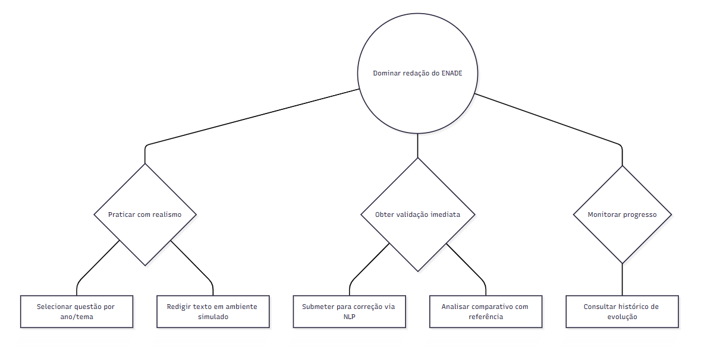
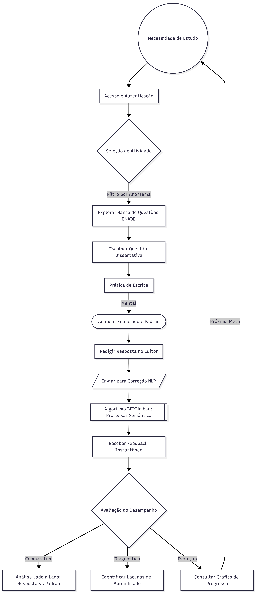
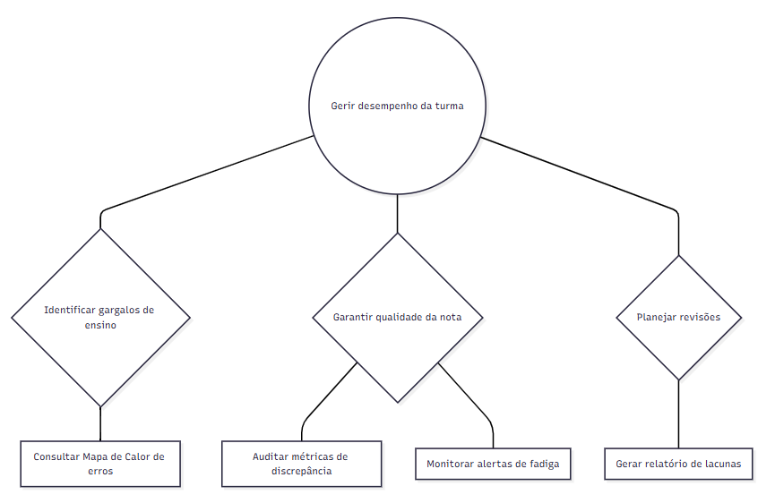
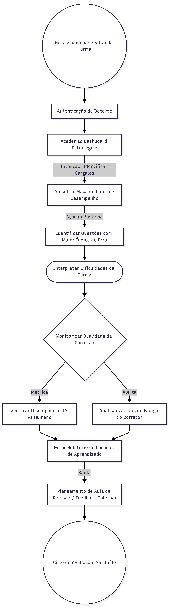

# 🧩 Modelo Conceitual

O modelo conceitual do QuestIA utiliza cenários de interação, Design Centrado na Comunicação (DCC) e Tabelas de Signos para estruturar a mensagem do sistema para o usuário.

## 1. Cenários de Interação (Solução)

Diferente dos cenários de problema, os cenários de interação descrevem como o usuário utiliza o QuestIA para atingir seus objetivos.

### Cenário A: Aluno recebendo Feedback
Beatriz acessa o simulado e digita sua resposta. O sistema exibe um indicador de processamento. Após 3 segundos, a tela se divide: do lado esquerdo, o texto da Beatriz com marcações; do lado direito, o "Padrão de Resposta" e a justificativa da nota. Beatriz percebe o termo faltante e clica em "Reescrever" para tentar novamente.

### Cenário B: Professor auditando nota
Ricardo abre o dashboard e vê um card de alerta: "Discrepância Detectada". Ele clica e o sistema mostra uma resposta que recebeu nota 4.0 da IA, mas que parece conter os conceitos corretos. Ricardo revisa, altera a nota para 8.0 e clica em "Confirmar Revisão". O sistema agradece e recalibra o modelo local de correção.

---

## 2. DCC (Design Centrado na Comunicação)

O sistema "fala" com o usuário através de uma metáfora de assistente especializado.

| Usuário diz: | Sistema (Designer Preposto) responde: |
| :--- | :--- |
| "Quero saber por que tirei nota 6." | "Aqui está o comparativo: você abordou o conceito X, mas esqueceu de mencionar a relação com Y, que vale 40% da nota." |
| "A turma está indo bem?" | "O desempenho médio é 7.5, mas 60% dos alunos falharam na questão sobre 'Algoritmos de Busca'. Deseja ver o relatório de lacunas?" |
| "Acho que essa nota da IA está errada." | "Entendido. Sua revisão manual será priorizada e o erro será reportado para melhoria do algoritmo." |

---

## 3. Mapas de Objetivos

### Fluxo do Aluno (Simulado)

### Fluxo do Professor (Auditoria)

---

## 4. Tabela Unificada de Signos

| Signo (Linguagem) | Tipo | Significado | Onde aparece? | Prevenção/Recuperação |
| :--- | :---: | :--- | :--- | :--- |
| **"Analisando..."** | Metassigno | Status de processamento da IA. | Todas as submissões. | Impede novo clique até finalizar. |
| **Ícone de Calor (Vermelho)** | Signo Estático | Indica baixo desempenho crítico. | Dashboard Professor. | - |
| **Botão "Reescrever"** | Signo Performativo | Permite nova tentativa imediata. | Feedback Aluno. | - |
| **Tooltip "?"** | Signo de Apoio | Explica o critério de pontuação. | Lista de Critérios. | Evita má interpretação da nota. |
| **Alerta "Discrepância"** | Metassigno | Indica divergência entre IA e humano. | Cards de Dashboard. | Sugere revisão manual imediata. |
